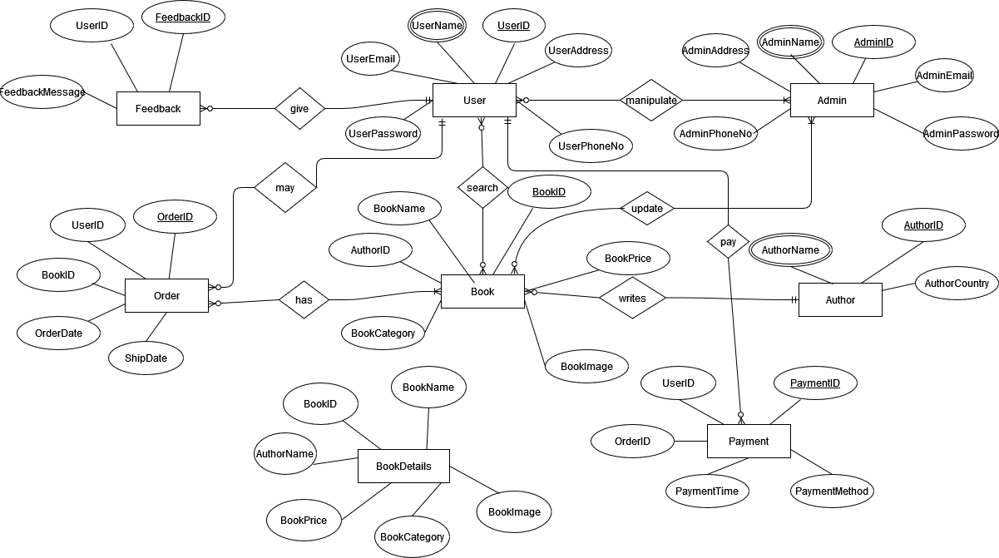
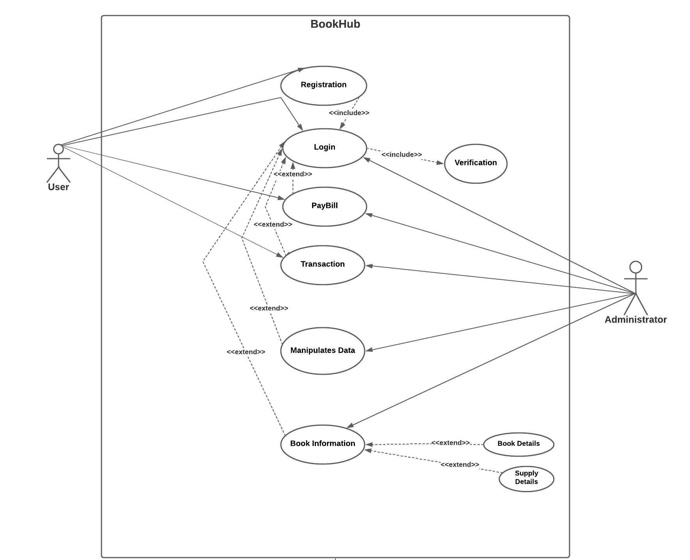
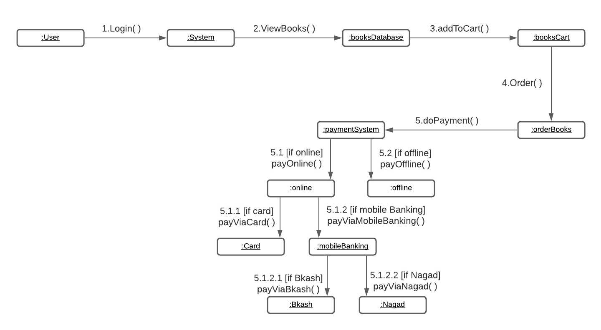
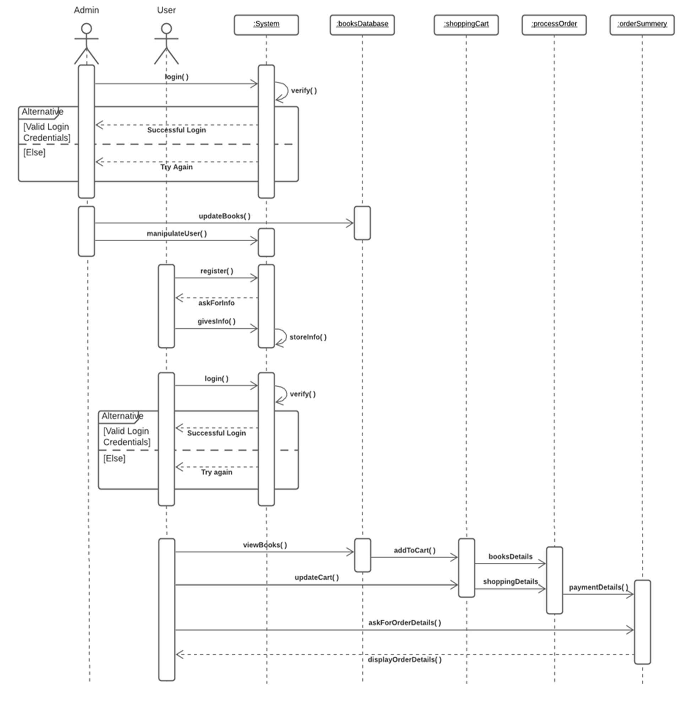

### Project Title:
BookHub-A Online Bookstore

### Demonstration:
The "Video_Instructions for using the Website.mp4" file shows how the project works.

### Description:
“BookHub” deals with people who want their books without any difficulties. By using this website people can search for their desired books very easily through the large database and order them online. Users can find different categories of books here like novels, poems, history, Science Fiction, Thrillers, etc. 

### Framework:
ASP.NET

### Features:
* Registration
* Login and Access
* Search for Books
* Product Show
* Admin Manipulation
* Contact with Admin

##### Admin
* The admin can log in through username and password. After login, admin can see all information on the “BookHub” and can Add, Update, and Delete information related to BookHub like book names, book prices, quantity, supply details, and user info. 
* The admin can see contact messages which were sent by website visitors or users. 
* Any user can give a contact message in search of any queries or can give complaints if they face any issues. After seeing these messages, the admin will take the necessary steps.

##### Users
* Each User has to Register himself through their name, phone number, email, and password. Then User goes to the login page and logs in with their registered email and password. 

* Users can see the whole Book-List of different categories like novels, poems, history, Science Fiction, Thriller, etc. after login. 

* They can send contact messages whenever they face any issues on the website or they can give messages in search of any queries

### Diagram
##### DFD diagram
* DFD level 0
 

* DFD level 1
 

* DFD level 2
 

##### ER diagram
 

##### Use case diagram
 

##### Collaboration diagram
 

##### Sequence diagram
 

.png)

